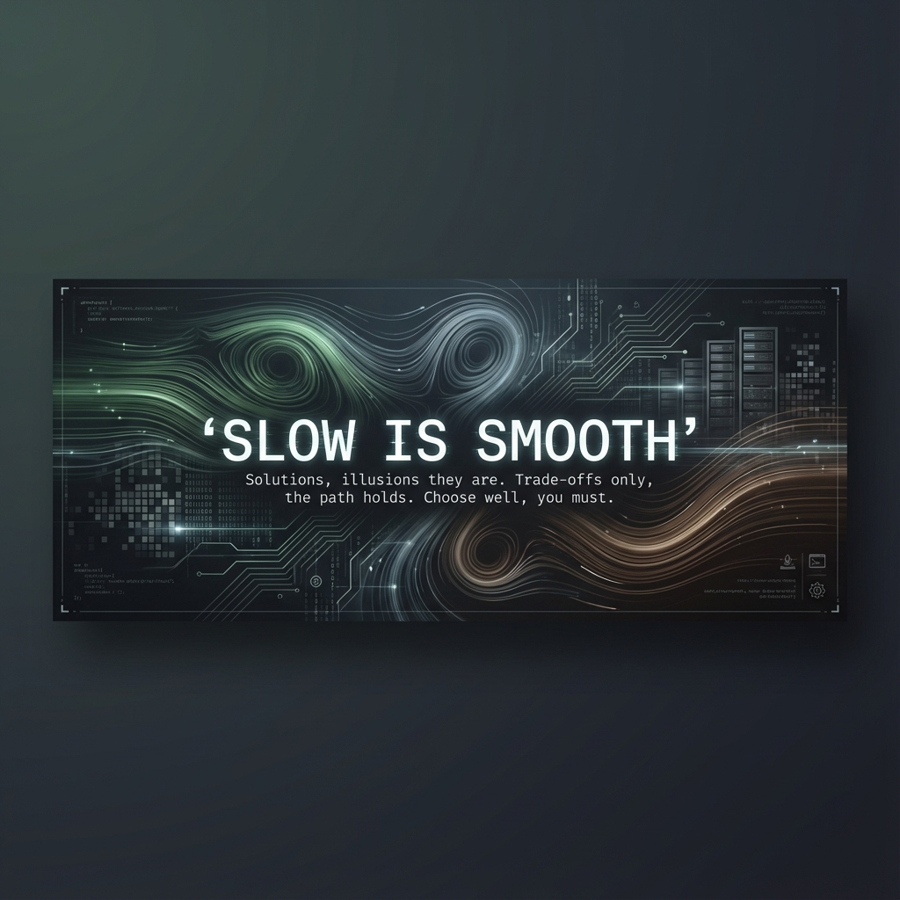

  

  <h1>Hi there, I'm Shai 👋</h1>
  
<b>Software Engineer & Systems Engineer & Open Source Developer & Puzzle Solver</b>

  
<b>Always learning, always curious</b>

  
I build high-performance tools and solve complex problems in C, C++, Python, Go and Assembly.

  
I'm currently focused on building high-performance computational fluid dynamics (CFD) libraries.

  
I'm also a puzzle solver, and I enjoy carcking real world 3d puzzles.

  

    
    
  

---

### 🛠️ Languages & Technologies

  <!-- Systems -->
  
  
  
  
  
   
  <!-- Infra -->
  
  
  
  
  

 

  <h3>🧠 Project Euler Progress</h3>
  

---

### 🚀 Project Spotlight

  
I’m currently focused on building high-performance computational fluid dynamics (CFD) libraries.

  
  
  

---

### ⚡ Contribution Graph

  

---

### 📊 GitHub Stats

  

