# Hi there, I'm <Your Name>! 👋

I'm a software developer passionate about building scalable tools and solving complex problems.

- 🔭 I’m currently working on **An open source high performance CFD library **
- 🌱 I’m currently learning **Advanced System Design**, **Rust** and **Zig**
- 👯 I’m looking to collaborate on **backend tooling**

- 📫 How to reach me: **shai@shaia.xyz**

---

### 🛠️ Languages 

  
  
  
  

### 🛠️ Systems Engineering Stack and Tools

  
  
  
  
 

   
  
  
  
  
  
  
   
  
  
  

---

### 🧠 Project Euler Progress

---

### 📊 GitHub Stats

  

---

