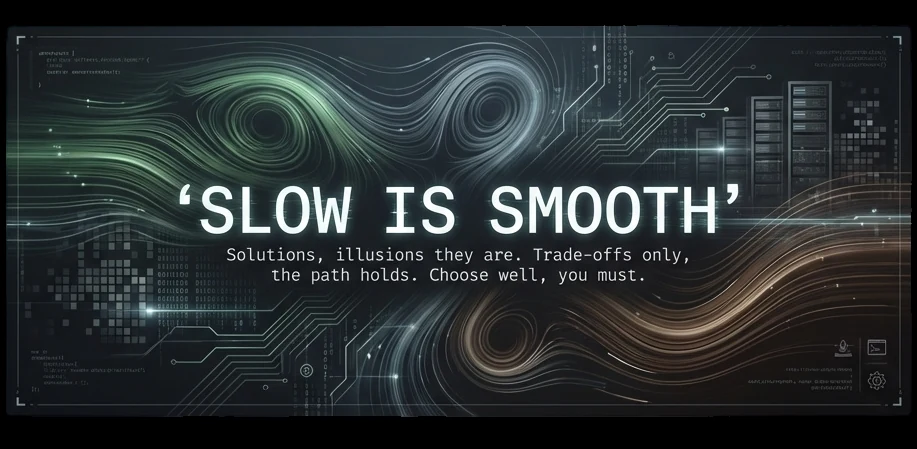

<div align="center">
  
</div>

<div align="center">
  <h1>Shai Asher</h1>
  <p>
    <b>Systems programmer.</b> Go, C, C++ and assembly — concurrency, SIMD and the parts of<br/>
    the runtime most people never have to think about. I make hot paths measurably faster,<br/>
    and I write down how.
  </p>
  <p>
    <a href="https://slow-is-fast.ghost.io/"></a>
    <a href="mailto:shai@shaia.xyz"></a>
    <a href="https://projecteuler.net/progress=shaia"></a>
  </p>
</div>

---

## Selected work

Numbers below are from the benchmarks in each repo, not estimates.

| Project | What it is | Measured |
|:--|:--|:--|
| **[BloomFilter](https://github.com/shaia/BloomFilter)** <br/> `Go` `AVX2` `NEON` | Lock-free SIMD Bloom filter. Zero allocations on the hot path, 64-byte aligned, atomic CAS instead of locks. | **26 ns** add · **23 ns** contains <br/> 3–4× faster than `willf/bloom` |
| **[SIMDCuckooFilter](https://github.com/shaia/SIMDCuckooFilter)** <br/> `Go` `AVX2` `NEON` | Cuckoo filter with hand-written assembly for bucket probing on x86-64 and ARM64. | **3–4×** scalar (AVX2) <br/> **2–3×** scalar (NEON) |
| **[tributary](https://github.com/shaia/tributary)** <br/> `C++20` `header-only` | Many-producer → one-consumer fan-in over bounded SPSC rings. A producer never blocks; overload drops and counts instead. | **22–29 ns** push, flat from 4 to 32 threads <br/> **3.87×** throughput at 4 consumers |
| **[CFD](https://github.com/shaia/CFD)** <br/> `C11` `OpenMP` `CUDA` | 2D/3D incompressible Navier–Stokes solver. Multigrid, RANS turbulence, four backends. | Validated against Ghia lid-driven cavity, <br/> Taylor–Green, and channel flow at Re<sub>τ</sub>=395 |

**Also building:** [thermolab](https://github.com/shaia/thermolab) and [wavelab](https://github.com/shaia/wavelab) — interactive bilingual (EN/HE) university physics courses running entirely in the browser on JupyterLite.

---

## Writing

I write up the optimisation work in long form — the wrong turns included.

<!-- BLOG-POST-LIST:START -->
- [The Bloom Filter Optimization Saga: A Deep Dive into Go Assembly and AVX2](https://slow-is-fast.ghost.io/the-bloom-filter-optimization-saga-a-deep-dive-into-go-assembly-and-avx2/)
- [The Bloom Filter Optimization Saga: Anatomy of a Go Concurrency Bug - Part 2](https://slow-is-fast.ghost.io/anatomy-of-a-go-concurrency-bug-2/)
- [The Bloom Filter Optimization Saga: Anatomy of a Go Concurrency Bug - Part 1](https://slow-is-fast.ghost.io/the-bloom-filter-optimization-saga-anatomy-of-a-go-concurrency-bug-part-1/)
- [The Bloom Filter Optimization Saga: From 3 Seconds to 66 Microseconds](https://slow-is-fast.ghost.io/the-bloom-filter-optimization-saga-from-3-seconds-to-66-microseconds/)
- [The most profound rules of software development.](https://slow-is-fast.ghost.io/the-most-profound-rules-of-software-development/)
<!-- BLOG-POST-LIST:END -->

---

## Crack the code

<details>
<summary><b>Level 1 — The systems check (C)</b></summary>

```c
main(){int i=1801675112;puts(&i);}
```

<details><summary><i>Reveal</i></summary>

`hack` — it prints the integer's bytes as ASCII: `0x6B636168` → `h a c k`.

</details>
</details>

<details>
<summary><b>Level 2 — The logic gate</b></summary>

If **slow is smooth** and **smooth is fast**, how much time is lost by rushing?

<details><summary><i>Reveal</i></summary>

**All of it.** Rushing creates mistakes, mistakes require fixing, fixing takes time.

</details>
</details>

<details>
<summary><b>Level 3 — The hidden flag</b></summary>

Somewhere on this page is a message that isn't rendered. Inspect the source, you must.
<!-- FLAG: U2hlbGwgd2UgcGxheSBhIGdhbWU/ -->

<details><summary><i>Reveal</i></summary>

`Shell we play a game?` — base64, in an HTML comment.

</details>
</details>

---

<div align="center">
  <picture>
    <source media="(prefers-color-scheme: dark)" srcset="https://raw.githubusercontent.com/shaia/shaia/output/github-contribution-grid-snake-dark.svg" />
    
  </picture>
  <br/><br/>
  
</div>
